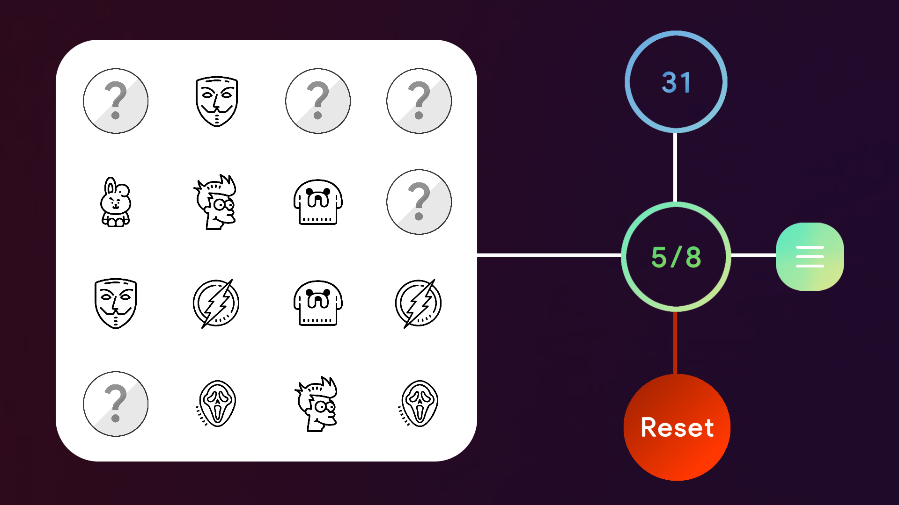
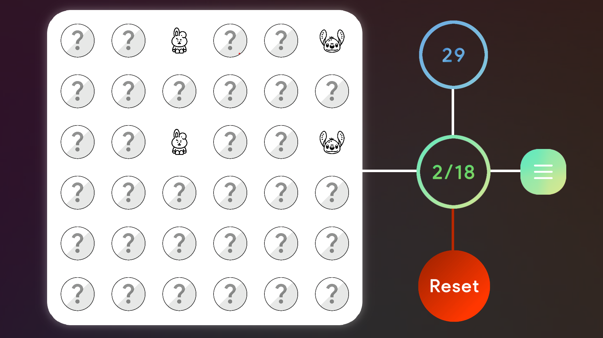
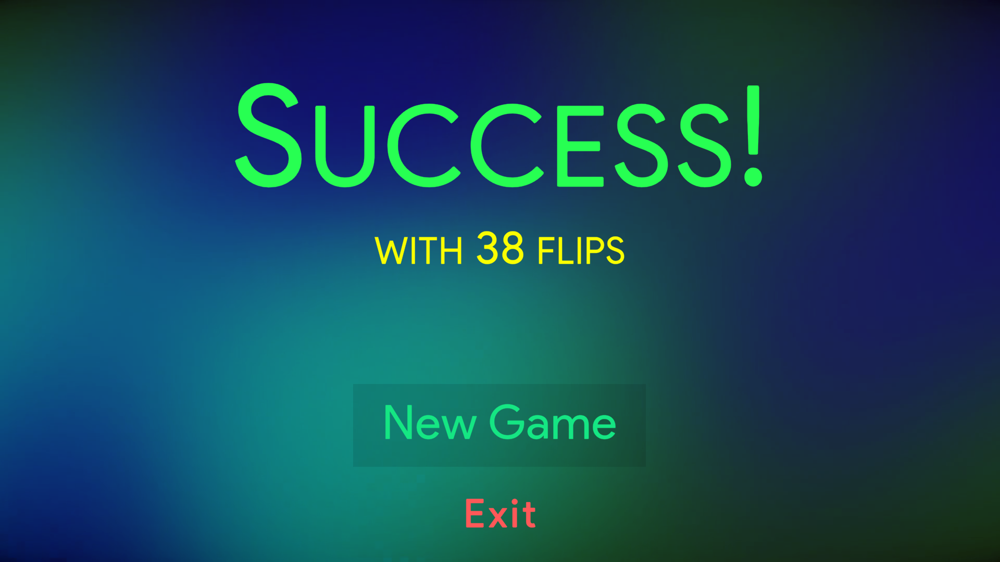

# Memory-Game using Unity and C# scripts
 

 <!-- PROJECT LOGO -->
<br />
<div align="center">
    
    <h3 align="center">Flipper</h3>
    <p>Flipper is a card memory game that can be played on Windows, Linux and on the Web. </p>
</div>

## Gameplay


https://github.com/Anindyait/Memory-Game/assets/91337664/4678dc74-9bef-4b13-aaa5-a8d9e5e28e4d


- Each image appears twice in the grid, you have to find every pair to win the game.

- The game has 2 modes, an easy 4x4 mode and a tough 6x6 mode.

## Screenshots





## Use
Clone the repo
```sh
git clone https://github.com/Anindyait Memory-Game
``` 
Open the repository using Unity
Made using <b>Unity 2022.3.7f1</b>
# 
# Play
- Play on web - https://anindya5.itch.io/flipper
###
- Download, unzip and play on Windows - <a href="https://github.com/Anindyait/Memory-Game/releases/download/Windows/Windows.zip">Windows Version</a>
###
- Download, unzip and play on Linux - <a href="https://github.com/Anindyait/Memory-Game/releases/download/Linux/Linux.zip">Linux Version</a>


